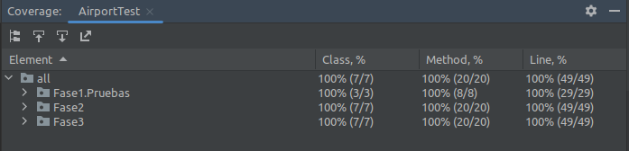
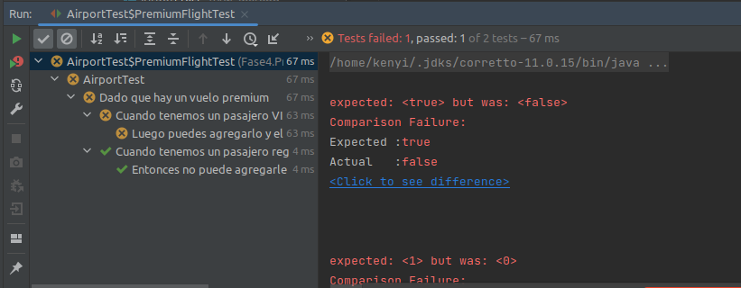
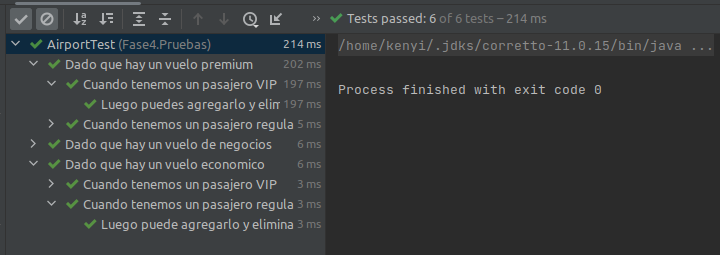
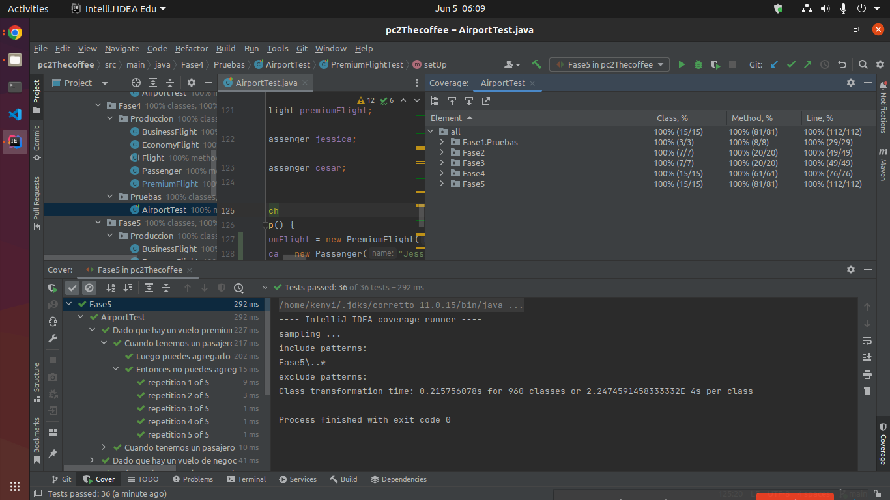

# pc2Thecoffee

| Integrantes                              |
|------------------------------------------|
| Alcantara Astete Kenyi Herry  20180343C  |
| Caycho Villalobos José Gabriel 20190584C |
|                                          |
|                                          |

---


0. Ejecuta el programa de la carpeta "anterior" y presenta los resultados y explica que sucede.

Se observa que nos da como resultado en consola:
```Console

Lista de pasajeros de vuelos de negocios:

Cesar

Lista de pasajeros de vuelos economicos:

Jessica
```
>Nota: La aplicación a este nivel se construyó sin seguir el metodo TDD. Solo siguiendo pruebas manuales y aun no se ha implementado pruebas automáticas.

---

1. Si ejecutamos las pruebas con cobertura desde IntelliJ IDEA, ¿cuáles son los
   resultados que se muestran?, ¿Por qué crees que la cobertura del código no es del 100%?.

Ejecutando la prueba de cobertura:


>No hay una cobertura del 100%. Si bien ejecutaron
> las 3 clases y los 8 métodos, solo hay una cobertura del 79% de líneas.
> Esto debido a que no pasaron todas líneas de alguna prueba.


>Creemos que no pasan todas la pruebas, porque seguramente
> una prueba no está siendo satisfacida.
> A simple vista vemos que el tipo de vuelo
> que tiene Jessica no corresponde a los tipos de vuelos creados.

Se observa en la clase Airport que solo se creó dos tipos: "Economico" y "Negocios".
```Java

public class Airport {

    public static void main(String[] args) {
        Flight economyFlight = new Flight("1", "Economico");  //Tipo Económico
        Flight businessFlight = new Flight("2", "Negocios");  //Tipo Negocios
        //...
    }
}

```
Y en una de las pruebas se está haciendo con un tipo "Business", el cual es diferente a las dos creadas en la
clase Airport.


``` Java

        @BeforeEach
        void setUp() {
            businessFlight = new Flight("2", "Business");  //Tipo Business != (Tipo Economico y Tipo Negocios)
        }

        @Test
        public void testBusinessFlightRegularPassenger() {
            Passenger jessica = new Passenger("Jessica", false);

            assertEquals(false, businessFlight.addPassenger(jessica));
            assertEquals(0, businessFlight.getPassengersList().size());
            assertEquals(false, businessFlight.removePassenger(jessica));
            assertEquals(0, businessFlight.getPassengersList().size());

        }
```

> Efectivamente, esa era la razón. Ya que si cambiamos "Business" por
> "Negocios" la prueba de cobertura pasa el 100%.

Código cambiado: De Business a Negocios:

``` Java

        @BeforeEach
        void setUp() {
            businessFlight = new Flight("2", "Negocios"); //Tipo Negocios
        }

        @Test
        public void testBusinessFlightRegularPassenger() {
            Passenger jessica = new Passenger("Jessica", false);

            assertEquals(false, businessFlight.addPassenger(jessica));
            assertEquals(0, businessFlight.getPassengersList().size());
            assertEquals(false, businessFlight.removePassenger(jessica));
            assertEquals(0, businessFlight.getPassengersList().size());

        }
```


Cobertura del 100%:


---


2.  ¿Por qué John tiene la necesidad de refactorizar la aplicación?.

>Porque si se le presenta la necesidad de agregar un tipo más de vuelo. Con
> la clase Flight dada que tiene dos metodos que continen cada una declaraciones de "comparaciones".
> Se tendria que agregar otras "comparaciones" adicionales para **cada** metodo.
> Que en este caso seria en 2 metodos (2 esfuerzos).

>Pero, si se aplica polimorfismo. Solo se tendría que crear **una** clase más para agregar un nuevo tipo de vuelo.
> Entonces el trabajo se reduce de "2 esfuerzos"  a "1 esfuerzo".


Código de la clase Flight que esta impleméntada con sentencias de "comparación". No utiliza polimorfismo. 

``` Java

public class Flight {

//...(Here is some hidden code)

    private String flightType;

//...(Here is some hidden code)


//Método 1
public boolean addPassenger(Passenger passenger) {
        switch (flightType) {                          
            case "Economico":                           //Sentencia de comparación
                return passengers.add(passenger);
            case "Negocios":                             //Sentencia de comparación
                if (passenger.isVip()) {
                    return passengers.add(passenger);
                }
                return false;
            default:
                throw new RuntimeException("Tipo desconocido: " + flightType);
        }

    }


//Método 2
    public boolean removePassenger(Passenger passenger) {
        switch (flightType) {
            case "Economico":                           //Sentencia de comparación
                if (!passenger.isVip()) {
                    return passengers.remove(passenger);
                }
                return false;
            case "Negocios":                               //Sentencia de comparación
                return false;
            default:
                throw new RuntimeException("Tipo desconocido: " + flightType);
        }
    }

}

```


>Si aplicamos polimorfismo, prevemos que el sistemas sería más escalable a futuras adiciones 
> de mas tipos de vuelos. 

>Tambien la eficienia (Performance) del software se estaria incrementado. Ya que ejecutaría **menos** sentencias de "comparaciones".  

---

3.  La refactorización y los cambios de la API se propagan a las pruebas.
   Reescribe el archivo Airport Test de la carpeta Fase 3.
   
>Luego de reescribir:


¿Cuál es la cobertura del código ?


Cobertura del 100%:




¿ La refactorización de la aplicación TDD ayudó tanto a mejorar la calidad del código?.

>La refactorizacion **si** ayudó a mejorar el código. Dado que implementa polimorfismo en lugar de un código **no escalable** con sentencias de "comparación".


---

4. ¿En qué consiste está regla relacionada a la refactorización?. Evita utilizar y
copiar respuestas de internet. Explica como se relaciona al problema dado en la evaluación.

> La **regla de tres** consiste en que si se tiene dos porciones de codigo similares,
> y sele quiere añadir otra mas, que tambien es similar. 
> La regla dice que ya no es eficiente agregar una tercera.
> Entonces, se debe refactorizar el codigo, de tal manera que
> que agrupe el codigo en un solo procedimiento. El cual debe ser equivalente en funcionalidad para cada comportamiento,
> pero mas eficiente en la ejecución. 

> En nuestro caso se observa, que tenemos dos tests similares (EconomyFlightTest y BusinessFlightTest).
> El cual solo cambia en el tipo de clase que se somete a prueba. 
> Pero si agregamos una nueva clase de otro tipo de vuelo, por ejemplo premium.
> Entonces se requerirá un test mas y tendriamos tres tests similares ahora.
> El cual estaria violando "la regla de tres".
> Por ello debemos buscar una nueva forma de agruparlos (En nuestro caso, con la anotación @Nested). 
> Dependiendo de que clase se quiere probar, este debe realizar el test a la clase en cuestion, de manera eficiente.    

Se observa 2 tests similares: 
``` Java

public class AirportTest {

    @DisplayName("Dado que hay un vuelo economico")
    @Nested
    class EconomyFlightTest {

        private Flight economyFlight;

        @BeforeEach
        void setUp() {
            economyFlight = new EconomyFlight("1");
        }

        @Test
        public void testEconomyFlightRegularPassenger() {
            Passenger jessica = new Passenger("Jessica", false);

            assertEquals("1", economyFlight.getId());
            assertEquals(true, economyFlight.addPassenger(jessica));
            assertEquals(1, economyFlight.getPassengersList().size());
            assertEquals("Jessica", economyFlight.getPassengersList().get(0).getName());

            assertEquals(true, economyFlight.removePassenger(jessica));
            assertEquals(0, economyFlight.getPassengersList().size());
        }

        @Test
        public void testEconomyFlightVipPassenger() {
            Passenger cesar = new Passenger("Cesar", true);

            assertEquals("1", economyFlight.getId());
            assertEquals(true, economyFlight.addPassenger(cesar));
            assertEquals(1, economyFlight.getPassengersList().size());
            assertEquals("Cesar", economyFlight.getPassengersList().get(0).getName());

            assertEquals(false, economyFlight.removePassenger(cesar));
            assertEquals(1, economyFlight.getPassengersList().size());
        }

    }

    @DisplayName("Dado que hay un vuelo negocios")
    @Nested
    class BusinessFlightTest {
        private Flight businessFlight;

        @BeforeEach
        void setUp() {
            businessFlight = new BusinessFlight("2");
        }

        @Test
        public void testBusinessFlightRegularPassenger() {
            Passenger jessica = new Passenger("Jessica", false);

            assertEquals(false, businessFlight.addPassenger(jessica));
            assertEquals(0, businessFlight.getPassengersList().size());
            assertEquals(false, businessFlight.removePassenger(jessica));
            assertEquals(0, businessFlight.getPassengersList().size());

        }

        @Test
        public void testBusinessFlightVipPassenger() {
            Passenger cesar = new Passenger("Cesar", true);

            assertEquals(true, businessFlight.addPassenger(cesar));
            assertEquals(1, businessFlight.getPassengersList().size());
            assertEquals(false, businessFlight.removePassenger(cesar));
            assertEquals(1, businessFlight.getPassengersList().size());

        }
        

    }

}

```

---

5.  Escribe el diseño inicial de la clase llamada PremiumFlight y agrega a la
Fase 4 en la carpeta producción.


>Dado que se implementará con el desarrollo basado en pruebas (TDD). Debemos realizar un diseño inicial, que solo
> retorna "false" en cada metodo de PremiumFlight.

Diseño inicial: 

``` Java

public class PremiumFlight extends Flight {

  // Diseño inicial de la clase  PremiumFlight
  public PremiumFlight(String id) {
      super(id);
  }

    @Override
    public boolean addPassenger(Fase4.Produccion.Passenger passenger) {
        return false;  //Retornamos false
    }

    @Override
    public boolean removePassenger(Passenger passenger) {
        return false; //Retornamos false
    }


}

```

---

6. Ayuda a John e implementa las pruebas de acuerdo con la lógica comercial
de vuelos premium de las figuras anteriores. Adjunta tu código en la parte que se indica en el código
de la Fase 4. Después de escribir las pruebas, John las ejecuta.

>A continuacion se muestra la implementación del test para la clase PremiumFilght.
>Pide como expectativas verdadero el poder agregar y eliminar pasajeros VIP. 
>Pide expectativa falso si se quiere agregar un pasajero regular. 


Código de la implementación del test para la clase PremiumFilght:
``` Java
    @DisplayName("Dado que hay un vuelo premium")
    @Nested
    class PremiumFlightTest {
        private Flight premiumFlight;
        private Passenger jessica;
        private Passenger cesar;

        @BeforeEach
        void setUp() {
            premiumFlight = new PremiumFlight("3");
            jessica = new Passenger("Jessica", false);
            cesar = new Passenger("Cesar", true);
        }

        @Nested
        @DisplayName("Cuando tenemos un pasajero regular")
        class RegularPassenger {

            @Test
            @DisplayName("Entonces no puede agregarle a un vuelo premium")
            public void testPremiumFlightRegularPassenger() {
                assertAll("Verifica todas las condiciones para un pasajero regular y un vuelo premium",
                        () -> assertEquals(false, premiumFlight.addPassenger(jessica)),//Comprobamos que no se puede agregar a un pasajero regular al vuelo premium
                        () -> assertEquals(0, premiumFlight.getPassengersList().size()),// comprobamos que no hay pasajeros en al avión
                        () -> assertEquals(false, premiumFlight.removePassenger(jessica)),// comprobamos que no se puede remover a jessica porque no esta en el avión
                        () -> assertEquals(0, premiumFlight.getPassengersList().size())// comprobamos que no hay pasajeros en al avión
                );
            }
        }

        @Nested
        @DisplayName("Cuando tenemos un pasajero VIP")
        class VipPassenger {

            @Test
            @DisplayName("Luego puedes agregarlo y eliminarlo de un vuelo de premium")
            public void testPremiumFlightVipPassenger() {
                assertAll("Verifica todas las condiciones para un pasajero VIP y un vuelo de premium",
                        () -> assertEquals(true, premiumFlight.addPassenger(cesar)),//Comprobamos que si se puede agregar a un pasajero Vip a un vuelo Premium
                        () -> assertEquals(1, premiumFlight.getPassengersList().size()),//Comprobamos que el pasajero se encuentra dentro del avión
                        () -> assertEquals(true, premiumFlight.removePassenger(cesar)),//Comprobamos que si es posible retirar a un pasajero Vip
                        () -> assertEquals(0, premiumFlight.getPassengersList().size())//Comprobamos el retiro del pasajero Vip
                );
            }
        }
    }
```

El resultado de correr el test es **Rojo**, el cual es normal (Uno de los primeros pasos) cuando se utiliza un 
desarrollo basado en pruebas (TDD). 




---

7. Agrega la lógica comercial solo para pasajeros VIP en la clase
PremiumFlight. Guarda ese archivo en la carpeta Producción de la Fase 5.

>La lógica comercial dice que solo los pasajero VIP pueden ser agregados 
>o eliminados del tipo de vuelo Premium.
>Un pasajero regular no puede ser agregado a un vuelo Premium. Por ende tampoco 
>pueden ser eliminado (No puedes eliminar algo que no existe). 

Agregando la lógica comercial de la clase premiumFlight:

``` Java

public class PremiumFlight extends Flight {

   //Logica comercial
   
   
    public PremiumFlight(String id) {
        super(id);
    }

    @Override
    public boolean addPassenger(Passenger passenger) {
        // si pasajero es vip, se agrega pasajero al avión.
        if (passenger.isVip()) {
            return passengers.add(passenger);
        }
        // si pasajero no es vip, no se agrega pasajero al avión.
        return false;
    }

    @Override
    public boolean removePassenger(Passenger passenger) {
        // si pasajero es vip, se elimina pasajero del avión.
        if (passenger.isVip()) {
            return passengers.remove(passenger);
        }
        // si pasajero no es vip, no se puede remover pasajero del avión.
        // Dado que no existe.(Un regular no se le pude agregar a un vuleo Premium) 
        return false;
    }
}


```

Se observa que las pruebas pasaron satisfactoriamente. Resultado **Verde**: 



---

8. Ayuda a John a crear una nueva prueba para verificar que un pasajero solo se
puede agregar una vez a un vuelo. La ejecución de las pruebas ahora es exitosa, con una cobertura de
código del 100 %. John ha implementado esta nueva característica en estilo TDD.


Implementación del Tests que prueba la unicidad de un pasajero:
```Java

public class AirportTest {

    @DisplayName("Dado que hay un vuelo economico")
    @Nested
    class EconomyFlightTest {

        private Flight economyFlight;
        private Passenger jessica;
        private Passenger cesar;

        @BeforeEach
        void setUp() {
            economyFlight = new EconomyFlight("1");
            jessica = new Passenger("Jessica", false);
            cesar = new Passenger("Cesar", true);
        }

        @Nested
        @DisplayName("Cuando tenemos un pasajero regular")
        class RegularPassenger {

            //...(Here is some hidden code)
            
            //Unicidad para pasajero regular en un vuelo de Económico. 
            
            @DisplayName("Entonces no puedes agregarlo a un vuelo economico mas de una vez")
            @RepeatedTest(5)
            public void testEconomyFlightRegularPassengerAddedOnlyOnce(RepetitionInfo repetitionInfo) {
                for (int i = 0; i < repetitionInfo.getCurrentRepetition(); i++) {
                    economyFlight.addPassenger(jessica);
                }
                assertAll("Verifica que un pasajero Regular se pueda agregar a un vuelo económico solo una vez",
                        () -> assertEquals(1, economyFlight.getPassengersSet().size()),
                        () -> assertTrue(economyFlight.getPassengersSet().contains(jessica)),
                        () -> assertTrue(new ArrayList<>(economyFlight.getPassengersSet()).get(0).getName().equals("Jessica"))
                );
            }
        }

        @Nested
        @DisplayName("Cuando tenemos un pasajero VIP")
        class VipPassenger {
            
            //...(Here is some hidden code)
            
            //Unicidad para pasajero VIP en un vuelo de Económico.
            
            @DisplayName("Entonces no puedes agregarlo a un vuelo economico mas de una vez")
            @RepeatedTest(5)
            public void testEconomyFlightVipPassengerAddedOnlyOnce(RepetitionInfo repetitionInfo) {
                for (int i = 0; i < repetitionInfo.getCurrentRepetition(); i++) {
                    economyFlight.addPassenger(cesar);
                }
                assertAll("Verifica que un pasajero VIP se pueda agregar a un vuelo económico solo una vez",
                        () -> assertEquals(1, economyFlight.getPassengersSet().size()),
                        () -> assertTrue(economyFlight.getPassengersSet().contains(cesar)),
                        () -> assertTrue(new ArrayList<>(economyFlight.getPassengersSet()).get(0).getName().equals("Cesar"))
                );
            }
        }
    }

    @DisplayName("Dado que hay un vuelo de negocios")
    @Nested
    class BusinessFlightTest {
        private Flight businessFlight;
        private Passenger jessica;
        private Passenger cesar;

        @BeforeEach
        void setUp() {
            businessFlight = new BusinessFlight("2");
            jessica = new Passenger("Jessica", false);
            cesar = new Passenger("Cesar", true);
        }

        @Nested
        @DisplayName("Cuando tenemos un pasajero regular")
        class RegularPassenger {

           //...(Here is some hidden code)

            // Unicidad para un pasajero Regular en un vuelo de negocios.

            @DisplayName("Entonces no puedes agregarlo a un vuelo de negocio")
            @RepeatedTest(5)
            public void testBusinessFlightRegularPassengerAddedOnlyOnce(RepetitionInfo repetitionInfo) {
                for (int i = 0; i < repetitionInfo.getCurrentRepetition(); i++) {
                    businessFlight.addPassenger(jessica);
                }

                assertAll("Verifica que un pasajero Regular no se pueda agregar a un vuelo de negocio",
                        () -> assertEquals(0, businessFlight.getPassengersSet().size())
                );
            }
        }

        @Nested
        @DisplayName("Cuando tenemos un pasajero VIP")
        class VipPassenger {

            //...(Here is some hidden code)

            // Unicidad para un pasajero VIP en un vuelo de negocios.

            @DisplayName("Entonces no puedes agregarlo a un vuelo de negocios mas de una vez.")
            @RepeatedTest(5)
            public void testBusinessFlightVipPassengerAddedOnlyOnce(RepetitionInfo repetitionInfo) {
                for (int i = 0; i < repetitionInfo.getCurrentRepetition(); i++) {
                    businessFlight.addPassenger(cesar);
                }
                assertAll("Verifica que un pasajero VIP se pueda agregar a un vuelo de negocios solo una vez",
                        () -> assertEquals(1, businessFlight.getPassengersSet().size()),
                        () -> assertTrue(businessFlight.getPassengersSet().contains(cesar)),
                        () -> assertTrue(new ArrayList<>(businessFlight.getPassengersSet()).get(0).getName().equals("Cesar"))
                );
            }
        }
    }

   
    @DisplayName("Dado que hay un vuelo premium")
    @Nested
    class PremiumFlightTest {
        private Flight premiumFlight;
        private Passenger jessica;
        private Passenger cesar;

        @BeforeEach
        void setUp() {
            premiumFlight = new PremiumFlight("3");
            jessica = new Passenger("Jessica", false);
            cesar = new Passenger("Cesar", true);
        }

        @Nested
        @DisplayName("Cuando tenemos un pasajero regular")
        class RegularPassenger {

            //...(Here is some hidden code)
            
          // Unicidad para un pasajero Regular en un vuelo de Premium.  
         
            @DisplayName("Entonces no puedes agregarlo a un vuelo de negocios")
            @RepeatedTest(5)
            public void testBusinessFlightRegularPassengerAddedOnlyOnce(RepetitionInfo repetitionInfo) {
                for (int i = 0; i < repetitionInfo.getCurrentRepetition(); i++) {
                    premiumFlight.addPassenger(jessica);
                }
                assertAll("Verifica que un pasajero Regular no se pueda agregar a un vuelo de negocios",
                        () -> assertEquals(0, premiumFlight.getPassengersSet().size())
                );
            }
        }

        @Nested
        @DisplayName("Cuando tenemos un pasajero VIP")
        class VipPassenger {

           //...(Here is some hidden code)
           
           // Unicidad para un pasajero VIP en un vuelo de Premium.

            @DisplayName("Entonces no puedes agregarlo a un vuelo premium mas de una vez")
            @RepeatedTest(5)
            public void testPremiumFlightVipPassengerAddedOnlyOnce(RepetitionInfo repetitionInfo) {
                for (int i = 0; i < repetitionInfo.getCurrentRepetition(); i++) {
                    premiumFlight.addPassenger(cesar);
                }
                assertAll("Verifica que un pasajero VIP se pueda agregar a un vuelo premium solo una vez",
                        () -> assertEquals(1, premiumFlight.getPassengersSet().size()),
                        () -> assertTrue(premiumFlight.getPassengersSet().contains(cesar)),
                        () -> assertTrue(new ArrayList<>(premiumFlight.getPassengersSet()).get(0).getName().equals("Cesar"))
                );
            }
        }
    }


}


```

Se muestra la prueba de cobertura del 100%:


