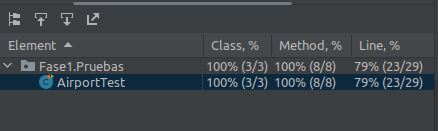
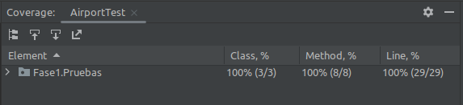

# pc2Thecoffee

0. Ejecuta el programa de la carpeta "anterior" y presenta los resultados y explica que sucede.

Se observa que nos da como resultado en consola:
```Console

Lista de pasajeros de vuelos de negocios:

Cesar

Lista de pasajeros de vuelos economicos:

Jessica
```
>Nota: La aplicación a este nivel se construyó sin seguir el metodo TDD. Solo siguiendo pruebas manuales y aun no se ha implementado pruebas automáticas.


1. Pregunta 1 (3 puntos) Si ejecutamos las pruebas con cobertura desde IntelliJ IDEA, ¿cuales son los
   resultados que se muestran?, ¿Por qué crees que la cobertura del código no es del 100%? .

Ejecutando la prueba de cobertura:



>No hay una cobertura del 100%. Si bien ejecutaron
> las 3 clases y los 8 métodos, Solo hay una cobertura del 79% de líneas.
> Esto debido a que no pasaron todas líneas.


>Creemos que no pasan todas la pruebas, porque seguramente
> una prueba no está siendo satisfacida, por
> que a simple vista vemos que el tipo de vuelo
> que tiene Jessica no corresponde a los tipos de vuelos creados.

Se observa que se creó solo los tipos "Economico" y "Negocios"
```Java

public class Airport {

    public static void main(String[] args) {
        Flight economyFlight = new Flight("1", "Economico");
        Flight businessFlight = new Flight("2", "Negocios");
        //...
    }
}

```
Y en una de las pruebas se está haciendo con un tipo "Business"


``` Java

        @BeforeEach
        void setUp() {
            businessFlight = new Flight("2", "Business");
        }

        @Test
        public void testBusinessFlightRegularPassenger() {
            Passenger jessica = new Passenger("Jessica", false);

            assertEquals(false, businessFlight.addPassenger(jessica));
            assertEquals(0, businessFlight.getPassengersList().size());
            assertEquals(false, businessFlight.removePassenger(jessica));
            assertEquals(0, businessFlight.getPassengersList().size());

        }
```

> Efectivamente, esa era la razon. Ya que si cambiamos "Business" por
> "Negocios" la prueba de cobertura es del 100%

Codigo cambiado:

``` Java

        @BeforeEach
        void setUp() {
            businessFlight = new Flight("2", "Negocios");
        }

        @Test
        public void testBusinessFlightRegularPassenger() {
            Passenger jessica = new Passenger("Jessica", false);

            assertEquals(false, businessFlight.addPassenger(jessica));
            assertEquals(0, businessFlight.getPassengersList().size());
            assertEquals(false, businessFlight.removePassenger(jessica));
            assertEquals(0, businessFlight.getPassengersList().size());

        }
```


Cobertura del 100%:




2. Pregunta 2 (1 punto) ¿ Por qué John tiene la necesidad de refactorizar la aplicación?.

>Porque si se le presenta la necesidad de agregar un tipo mas de vulelo, con
> la clase dada que tien dos metodos que continen declaraciones de "comparaciones",
> se tendria que agregar otras "comparaciones" adicionales para cada metodo.
> Que en este caso seria en 2 metodos (2 esfuerzos).

``` Java

public class Flight {

//...
    private String flightType;
//...
    public boolean addPassenger(Passenger passenger) {
        switch (flightType) {
            case "Economico":
                return passengers.add(passenger);
            case "Negocios":
                if (passenger.isVip()) {
                    return passengers.add(passenger);
                }
                return false;
            default:
                throw new RuntimeException("Tipo desconocido: " + flightType);
        }

    }

    public boolean removePassenger(Passenger passenger) {
        switch (flightType) {
            case "Economico":
                if (!passenger.isVip()) {
                    return passengers.remove(passenger);
                }
                return false;
            case "Negocios":
                return false;
            default:
                throw new RuntimeException("Tipo desconocido: " + flightType);
        }
    }

}

```

>Pero, si se aplica polimorfismo. Solo se tendria que crear una clase mas.
> Entonces el trabajo se reduce de 2 esfuerzos  a 1 esfuerzo.

>De esta manera el sistemas seria mas escalable a futuras adiciones 
> de mas tipos de vuelos. 

>Tambien la eficienia (Performance) del software se estaria aumentado. Ya que ejecutaria **menos** sentencias "comparaciones".  

3. Pregunta 3 (3 puntos) La refactorización y los cambios de la API se propagan a las pruebas.
   Reescribe el archivo Airport Test de la carpeta Fase 3.
>Luego de rescribir y agregarle test.


¿Cuál es la cobertura del código ?
>Hay un cobertura de codigo del 100% (Pasa todas las pruebas).

¿ La refactorización de la aplicación TDD ayudó tanto a mejorar la calidad del código?.
>La refactorizacion si ayudo a mejorar el codigo. Dado que implementa polimorfismo en lugar de solo condicionales.
